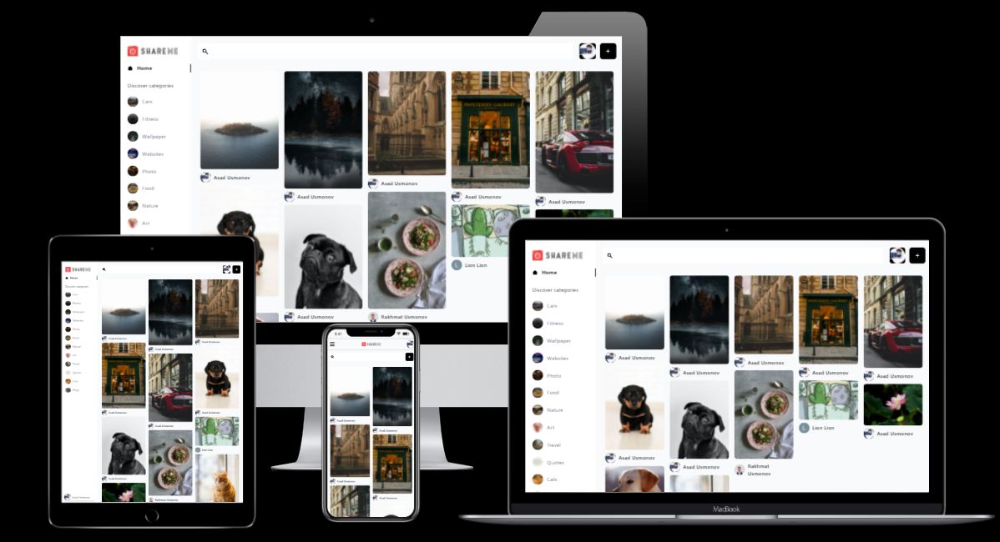

  <h3 align="center">Share Me</h3>

  

    <a href="https://share-m-e.netlify.app/">View Demo</a>
    ·
    <a href="https://github.com/UAsad99/Share-Me/issues">Report Bug</a>
    ·
    <a href="https://github.com/UAsad99/Share-Me/issues">Request Feature</a>
  

<b>Share Me</b> - share your images with people!

### Built With

* [React](https://reactjs.org)
* [TailwindCss](https://tailwindcss.com)
* [SanityCMS](https://www.sanity.io)
* [Google Auth](https://console.cloud.google.com)

## Contact

Asad - [Telegram](https://t.me/ua_tm) - uasad99@gmail.com

Project Link: [https://github.com/UAsad99/Share-Me](https://github.com/UAsad99/Share-Me)
